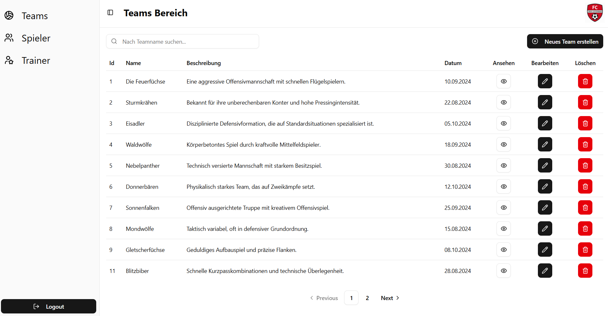
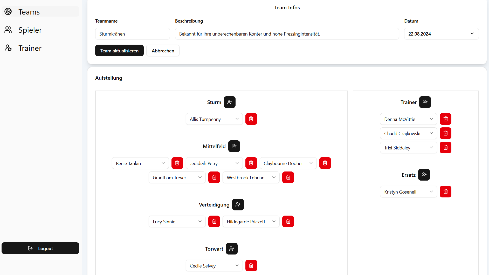
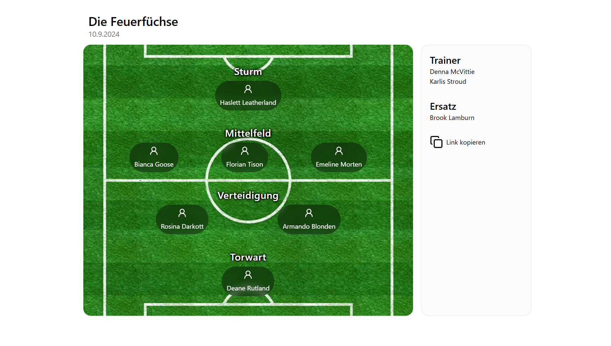
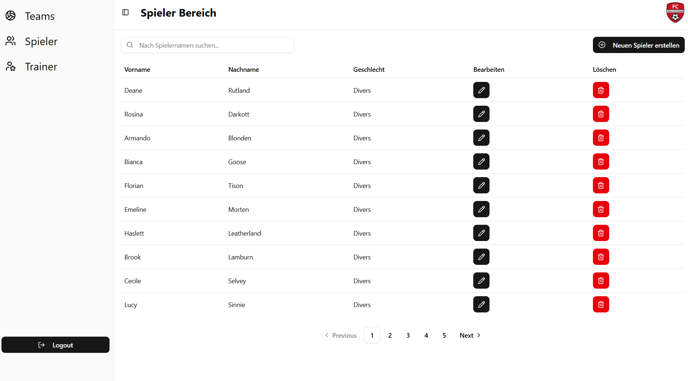

# ⚽ Football Squad Manager

A modern web application for managing and sharing football squads.

This project is an improved and extended version of my IPA project, focusing on better structure, improved UI/UX, and additional features.

---

### 🔐 Admin Area

- Create, edit and delete squads
- Manage players and trainers
- Assign players to positions (Squad Builder)
- Form validation using React Hook Form & Zod

### ⚽ Squad Builder

- Dynamic lineup creation
- Assign players to positions (Striker, Midfielder, Defender, Goalkeeper)
- Add backup players and trainers
- Prevent duplicate player selection

### 🌍 Public Squad View

- Share squads via unique link
- Display players grouped by position
- Visual football pitch layout
- Responsive design for mobile and desktop

### ⚙️ General

- Authentication with NextAuth
- API integration with NestJS backend
- Clean and modern UI using Tailwind & shadcn/ui
- Responsive layout

---

## 🛠️ Tech Stack

- **Framework:** Next.js (App Router)
- **Language:** TypeScript
- **Auth:** NextAuth
- **UI:** Tailwind CSS + shadcn/ui
- **Forms:** React Hook Form + Zod
- **Backend:** NestJS (REST API)

---

## 📸 Screenshots

### Admin – Teams



### Squad Builder



### Public Squad View



### Admin – Players



---

## ⚙️ Setup

### Requirements

- Node.js v20
- npm
- Running NestJS backend

### Installation

```bash
npm install
cp .env.example .env
```
